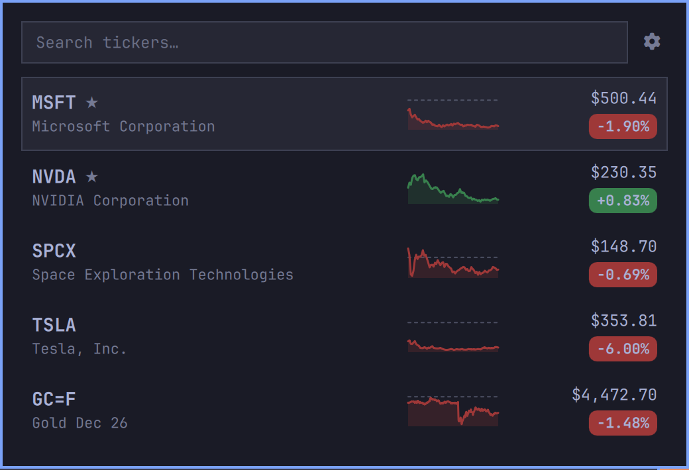
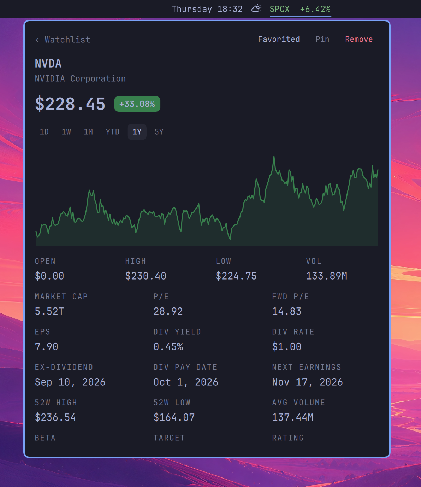

# Omafinance

**Omafinance** is an Omarchy bar watchlist for stocks and crypto. A pinned ticker (or a rotating set) lives on the bar; click it for sparklines, search-to-favorite, range charts, and fundamentals — no API key.

| Watchlist | Detail |
| :-------: | :----: |
|  |  |

## Features

- **Bar pill** — shows a pinned ticker and its % change (green / red)
- **Watchlist** — symbol, name, sparkline, price, and change pill
- **Search** — look up a ticker, open it, then Favorite to keep it
- **Crypto** — Yahoo-style symbols such as `BTC-USD` and `ETH-USD`
- **Pin rotation** — pin several tickers; the bar cycles them every 5 seconds
- **Detail chart** — `1D` `1W` `1M` `YTD` `1Y` `5Y` `All`, with range % and hover price
- **Fundamentals** — market cap, P/E, dividends, next earnings, 52-week range, target, rating
- **Remembered prefs** — watchlist, pins, and last chart range

No API key. Quotes come from Yahoo Finance.

## Install

```bash
omarchy plugin add https://github.com/mohamedmansour/omafinance.git --enable
```

Omafinance lands on the center of the bar. Move it with:

```bash
omarchy bar move mohamedmansour.finance --section right
```

## Update

Updates follow git. After new commits are on GitHub:

```bash
omarchy plugin update mohamedmansour.finance
```

You will see a diff, then a fast-forward. The `version` field in `manifest.json` is only a label — you do not need a new version number for the updater to run.

Update every git-managed plugin:

```bash
omarchy plugin update
```

## Uninstall

```bash
omarchy plugin remove mohamedmansour.finance
```

Your watchlist file is left in place (see Data below).

## Usage

| Action | What it does |
| --- | --- |
| Left click the bar pill | Open / close the watchlist |
| Middle click the bar pill | Refresh quotes |
| Type in search | Find a stock or crypto |
| Enter on a search result | Open detail (does not auto-favorite) |
| Favorite | Add or remove the ticker from the watchlist |
| Pin | Add or remove it from the bar rotation |
| Remove | Drop it from the watchlist |
| Click a watchlist row | Open the detail chart |
| Hover the detail chart | Price badge at that point |
| Esc | Back to the list, or close |

Keyboard while the panel is open: `/` to search, `p` to pin the selected row, Esc to go back.

From a terminal:

```bash
omarchy-shell mohamedmansour.finance toggle
```

## Data

Watchlist, pinned tickers, and chart range:

```
~/.local/state/omarchy/settings/finance.json
```

Quotes are fetched with `curl` from Yahoo Finance. Nothing is sent to this project’s servers.

## License

MIT
